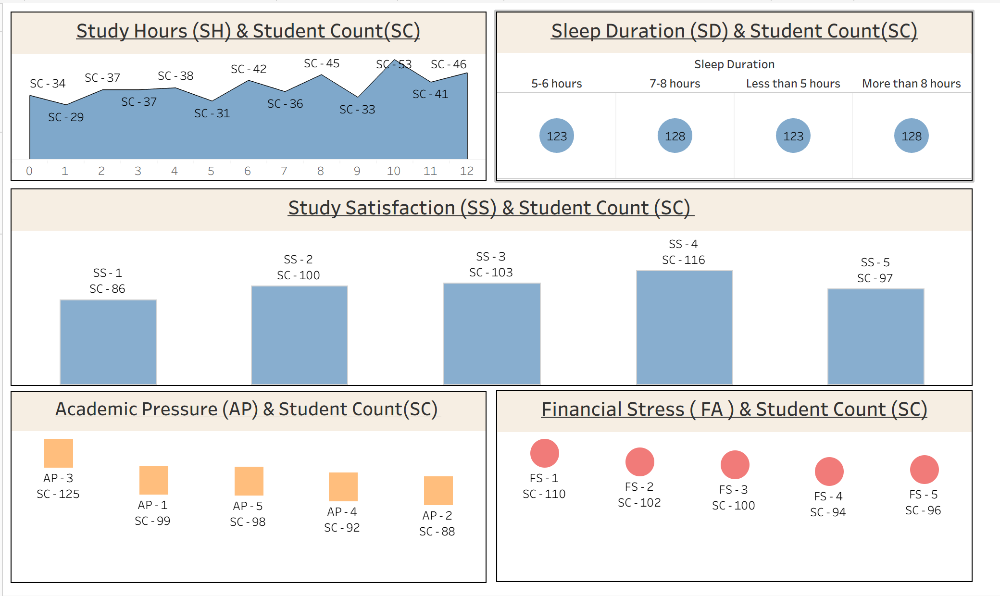

# 🎓 Student Mental Health & Academic Stress Analytics – Tableau

---

### Dashboard Link: [https://github.com/tyagi-4080/Student-depression-data-analysis/blob/main/Tableau%20Desktop%20Dashboard%20-%201%20(%20Student%20Depression%20).twb]

---

## Problem Statement

Educational institutions and student advisors required a unified visual platform to evaluate key lifestyle and academic stressors affecting student populations. 

By mapping student response volumes across multiple behavioural metrics, this Tableau dashboard analyzes how study hours, sleep duration, study satisfaction ratings, academic pressure levels, and financial stress factors intersect across student cohorts.

---

## Data Analytics Workflow
Student Survey Dataset ──► Tableau Data Connection ──► Chart & KPI Modeling ──► Interactive Single-Page Dashboard ──► Insights Generation
## Key Metrics & Dashboard Visuals

- **Study Hours (SH) vs. Student Count (SC)**: Area chart tracking student concentration across varying daily study hours (0–12 hours).
- **Sleep Duration (SD) vs. Student Count (SC)**: Distribution analysis across 5–6 hours, 7–8 hours, less than 5 hours, and more than 8 hours of sleep.
- **Study Satisfaction (SS) vs. Student Count (SC)**: Bar chart measuring student density across satisfaction scale tiers (SS-1 to SS-5).
- **Academic Pressure (AP) vs. Student Count (SC)**: Breakdown of student volumes categorized by perceived academic pressure levels (AP-1 to AP-5).
- **Financial Stress (FS) vs. Student Count (SC)**: Metric tracking student distribution across financial stress ratings (FS-1 to FS-5).

---

# Snapshot of Dashboard

---

# Key Insights

* **Balanced Sleep Distribution**: Student counts remain relatively balanced across sleep categories, with 128 students reporting 7–8 hours and 123 students receiving less than 5 hours of sleep.
* **Peak Study Satisfaction**: The highest student density occurs at Study Satisfaction level 4 (SS-4 = 116 students), indicating moderate-to-high overall academic engagement.
* **Academic Pressure Breakdown**: Academic Pressure level 3 (AP-3) represents the highest concentration of students (125 students).
* **Financial Stress Impact**: Financial Stress level 1 (FS-1) recorded the highest student count (110 students), showing a high concentration of initial financial pressure reporting.
